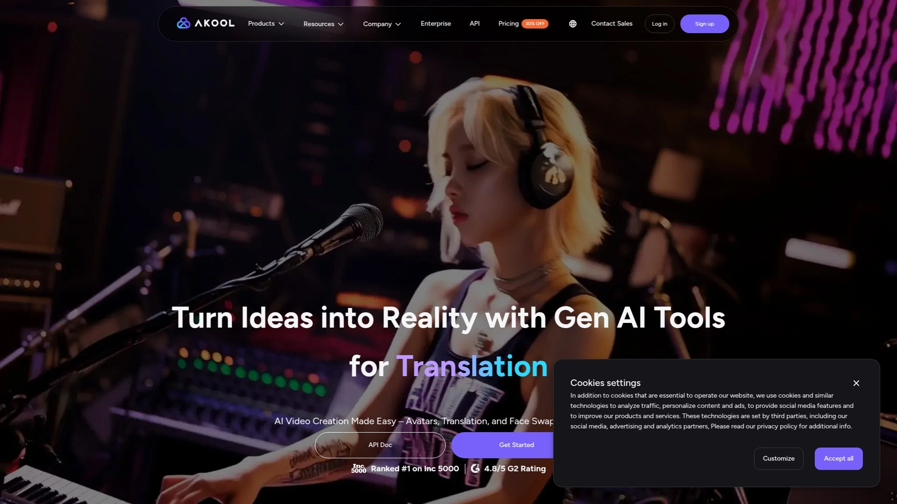
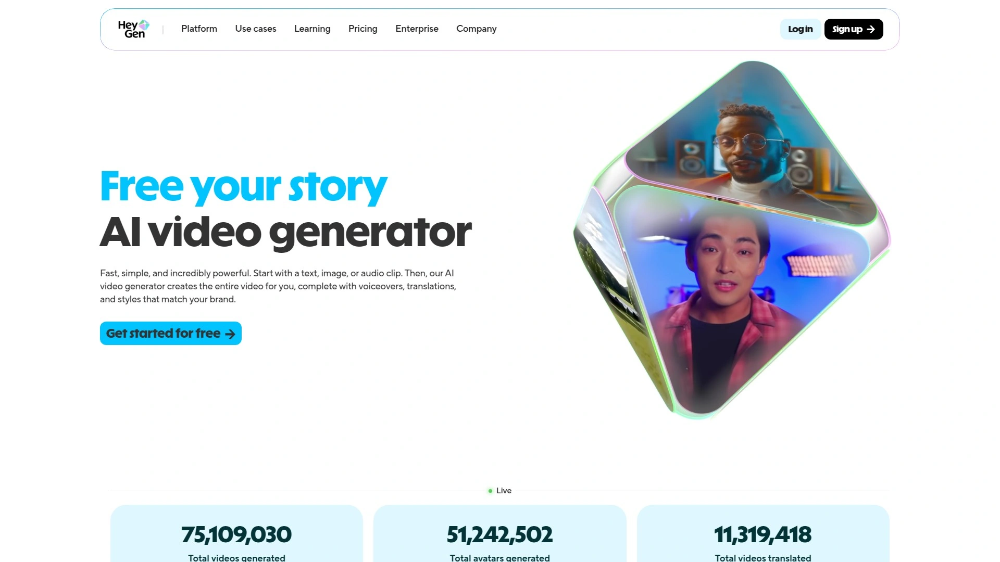
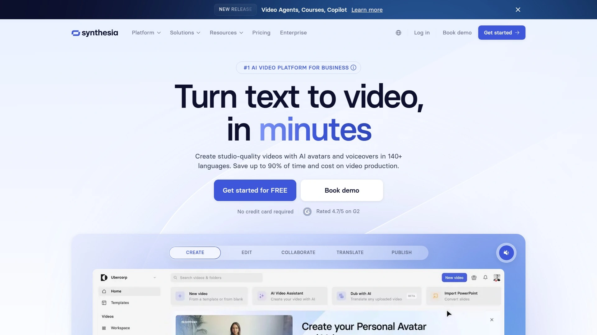
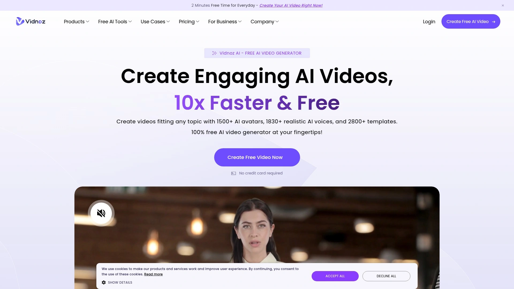
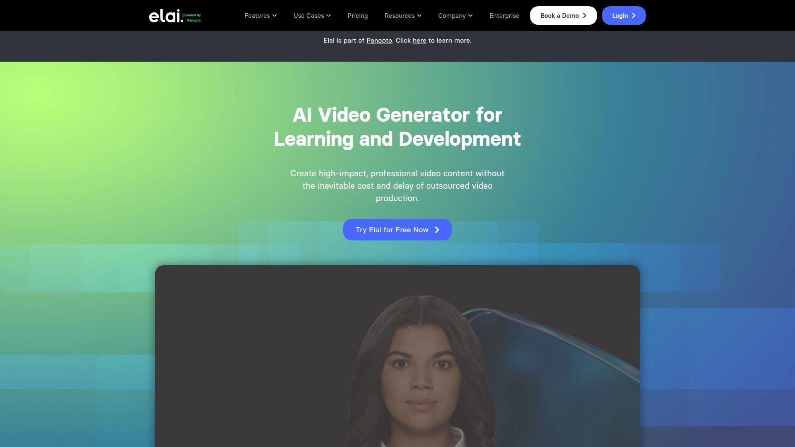
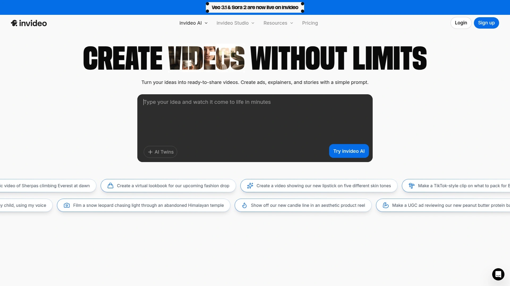
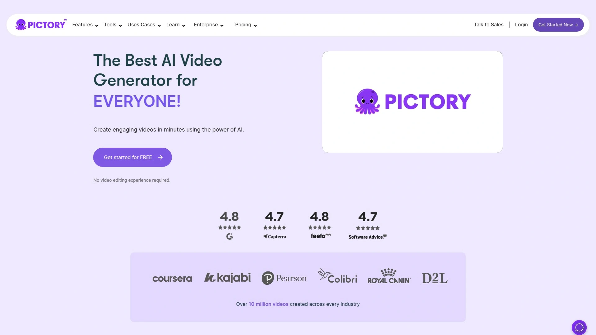
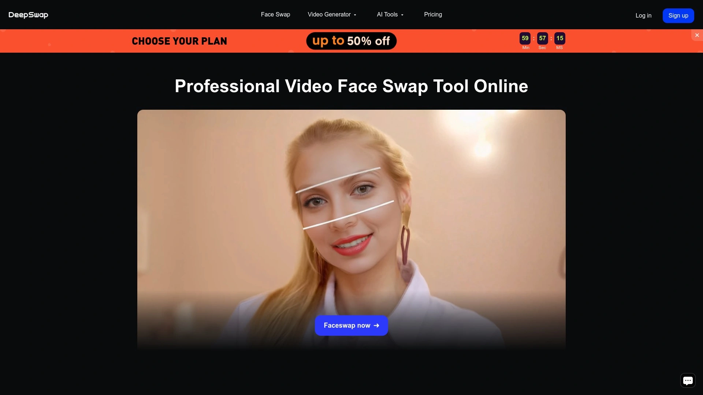

# 2025's Top 12 Best AI Video Creation Platforms

Creating professional videos used to mean hiring crews, booking studios, and burning through budgets faster than you could say "cut." Now AI video creation platforms let you generate talking avatars, swap faces, translate content into dozens of languages, and produce studio-quality footage without ever touching a camera. Whether you're scaling marketing content, building training materials, or just need a digital spokesperson who never calls in sick, these platforms turn text and images into broadcast-ready videos in minutes instead of weeks.

## **[AKOOL](https://akool.com)**

The all-in-one video suite that Fortune 500 companies actually use.

AKOOL ranks #1 on Inc 5000 and earned that spot by packing every AI video tool you'd ever need into one platform—avatars, face swap, video translation, talking photos, background changes, and live camera features that work in real-time during Zoom calls. The platform has generated over 300 million AI assets for 73,000+ companies, with 7 million individual users trusting it for everything from marketing campaigns to customer support videos. What separates AKOOL from competitors is the full-body photorealistic avatars that move naturally rather than just bobbing heads, plus multilingual translation that customizes post-generation and handles unique jargon your industry actually uses.

The Live Camera feature deserves special attention—it replaces your video feed with a hyper-realistic AI avatar that lip-syncs in real time, compatible with Zoom, Google Meet, and Teams. This means you can attend meetings as your digital twin while you're actually in pajamas. Major brands like Canon, Coca-Cola, Qatar Airways, and Logitech have deployed AKOOL for campaigns, with Canon showcasing an AI photo booth at internal events and Coca-Cola using it for their "Ultimate You" game. The platform cuts content creation costs by up to 80% while maintaining enterprise-grade security with SOC 2 compliance and independent audits.

AKOOL offers templates to speed up production, lets you upload existing files or start from scratch, and the Image to Video feature transforms static photos into animated clips with customizable sounds. The Face Swap tool works on both photos and videos with realistic alignment and smooth blending, while the Background Change feature saves massive editing time for e-commerce and product photography. With a 4.8/5 G2 rating and trust from Fortune 500 companies, AKOOL delivers the comprehensive toolkit that scales from solo creators to global enterprises without sacrificing quality or speed.

## **[HeyGen](https://www.heygen.com)**

The avatar platform that nailed real-time conversations.

HeyGen established itself as the go-to tool for AI avatar videos with one killer feature most competitors lack—interactive avatars that have real-time conversations, effectively functioning as video chatbots. The platform offers over 300 diverse stock avatars or lets you create custom clones by uploading videos or photos, with motion controls for adjusting facial expressions and movements to match your exact message. Translation capabilities span over 175 languages and dialects with automated API support, which content creators used to great effect when translating TikTok videos to Chinese during the RedNote migration—realistic enough to fool followers if they weren't watching closely.

The free plan actually delivers usable value unlike many competitors—one custom video avatar, three videos up to three minutes monthly, 30+ languages, and 720p export. The Creator plan at $24 monthly (billed annually) removes watermarks, unlocks the full language library, and provides unlimited videos up to five minutes each. Team plans run $30 per user monthly with a two-user minimum, expanding maximum video length to 30 minutes and adding collaborative workspace features.

HeyGen carries NSF Certified for Sport designation, meaning independent third-party testing confirms contents match labels with no banned substances—critical for athletic organizations. The face swap video tool maintains unmatched precision and realism, preserving natural expressions, lighting, and details whether you're creating content for entertainment or marketing. With over 1000 avatars available and the ability to pair face swaps with voice cloning for fully immersive experiences, HeyGen solved the realism problem that makes most AI videos feel robotic.

## **[Synthesia](https://www.synthesia.io)**

The enterprise favorite with 140 languages and zero filming hassle.

Synthesia powers video creation for over 60% of Fortune 100 companies by eliminating cameras, actors, and studios entirely—just input scripts, select avatars and voices, and the AI generates fully synthesized videos with realistic lip-syncing. Founded in 2017 and based in London, the platform supports 140+ languages and accents, making it essential for global enterprises scaling content production across borders. Users create content via pre-generated AI presenters or digital representations of themselves through the platform's AI video editing tool, with avatars narrating videos generated from text in multiple gender options.

The platform shines in corporate training, e-learning, marketing, and internal communications where professional-quality videos need consistent delivery without expensive equipment or editing skills. One-click video updates mean no broken links or duplicate files—every version syncs automatically to the original video. Screen recordings get instant transcripts without "ums" or "uhs," with instant editing, updating, and translation capabilities. The multilingual player organizes and displays all 140+ language versions in a single interface.

Synthesia prohibits non-consensual clones including celebrities or political figures for satirical purposes, requiring explicit consent plus strict pre-screening to avoid deepfaking. Videos export in SCORM format for any learning management system with automatic syncing to keep content current. Analytics provide views, drop-offs, and completion rates so you can optimize every video beyond just generating content. The platform automates tedious video production tasks while delivering the polish that corporate environments demand, though the enterprise focus means pricing sits in premium territory.

## **[D-ID](https://www.d-id.com)**

The viral sensation behind Deep Nostalgia that brought ancestors to life.

D-ID unleashed Deep Nostalgia, the internet phenomenon that captivated millions by animating historical figures and family ancestors into lifelike videos. The Creative Reality Studio uses generative AI to create avatar-driven videos with photo-based, video-based, or custom-generated avatars ideal for marketing, training, or storytelling. Advanced speech synthesis and facial animation models match lip movement and expressions with speech in real-time, ensuring human-like synchronization that feels natural and fluid. Support for 120+ languages with multilingual voice capabilities means you can create avatar videos speaking different languages and accents perfect for global audiences or localized marketing.

The streamlined editing suite manages video production effectively with multiple scenes, templates, and layered media elements including images, videos, backgrounds, shapes, and text. You can directly edit, resize, and adjust media on the canvas, with the platform built for speed—creating high-quality videos in minutes instead of days. D-ID recently partnered with Spring ACT, a Swiss non-profit, to bring an untraceable chatbot to life enabling domestic violence victims to talk to a photorealistic avatar in 13 languages, showcasing the technology's humanitarian applications.

Every detail stays in your control from avatar appearance to voice and language, letting you tailor each video to match your brand and message. The platform replaces expensive video shooting with AI efficiency, delivering professional-grade results at a fraction of traditional production costs. Integration works smoothly with favorite tools and platforms so you can create and deploy videos without workflow disruption. Whether making one video or one thousand, D-ID handles volume without sacrificing quality or creativity, scaling infinitely once you establish your template.

## **[Colossyan Creator](https://www.colossyan.com)**

The document-to-video converter that turns PDFs into presentations.

Colossyan Creator transforms text, PDFs, and PowerPoint presentations into complete videos using AI avatars and automated voiceovers, eliminating the need for cameras or editing tools. The platform provides 150+ AI avatars and voices with diverse realistic options covering formal narrators to friendly presenters, giving full control over message delivery tone. You can create a personal AI avatar modeled after your appearance and voice for consistent branding, enabling your digital twin to deliver videos while saving time from on-camera shoots.

Translation support spans 70+ languages with automatic dubbing, making content accessible to global audiences without hiring translators or voice actors. Users can select presenters with matching clothing styles and regional accents to align video appearance with audience culture or professional context. The platform utilizes AI technology offering templates, AI voices, customizable avatars, screencapture, subtitles, and a brand kit—everything needed for workplace learning. Collaboration features allow multiple team members to work together seamlessly on projects.

The beautiful and easy-to-use interface packs endless solutions whether you need training videos, corporate communications, or product demos. Videos are created in less than five minutes with real actors as presenters, making professional content accessible to anyone. The platform supports multilingual scripts, custom branding, and various aspect ratios to suit different platforms. Users can easily edit scenes, add subtitles, and fine-tune content within the intuitive interface designed for creators, educators, and businesses producing engaging visual content with minimal effort.

## **[Vidnoz AI](https://www.vidnoz.com)**

The free-tier champion with 1500 avatars and zero upfront cost.

Vidnoz AI stands out by offering genuinely usable free credits for new users, making it the perfect entry point for creators testing avatar videos before committing to paid tools. The platform provides 1500+ AI avatars built from real people plus 2800+ video templates, with 1840+ natural AI voices across 140+ languages covering casual to corporate tones, accents, and emotions. Text-to-speech with emotional control transforms written text into expressive, high-quality voiceovers with perfect pacing and clarity. The talking photo feature uploads any photo and brings it to life with realistic lip-syncing and facial gestures, perfect for greetings, storytelling, or viral short videos.

Voice cloning captures your unique voice or uploads existing recordings, generating sound-alike audio within one minute. The platform is widely used for training, explainer videos, product demos, and fun messages by educators, marketers, YouTubers, startups, and HR teams. Creating videos requires just four steps—choose template and avatar, type script or upload photos, add custom touches like music and effects, then click generate. The cross-device functionality means accounts work on both mobile apps and online tools.

Free trial provides watermarked outputs with limited resolution and video length, while paid plans start from $26.99 monthly. The cost-effective approach eliminates needs for cameras, studios, and sound stages while saving massive time compared to preparing, shooting, and editing traditional videos. Over 15 million customers have chosen Vidnoz, with templates and avatars supporting corporate promo videos, employee training, product showcases, and social media marketing content across various business scenarios. The multi-language support with decent options makes it accessible for beginners wanting to try AI-powered video avatars without paying upfront.

## **[Elai.io](https://elai.io)**

The corporate training specialist with interactive quizzes built in.

Elai.io specializes in AI-powered video generation for employee learning, trusted by over 2000 clients including Fujitsu, Beiersdorf, and Generali. The platform allows generating interactive video content narrated by digital human presenters in minutes without cameras, studios, or green screens. Users can generate training videos from text or URL inputs, translate videos into 75+ languages in seconds, and craft training scripts from scratch with AI Storyboard. The interactive quiz and workflow features enhance viewer engagement beyond passive watching, making it particularly effective for corporate learning environments.

The platform offers 80+ high-quality avatars with the ability to create custom digital avatars from videos or photos, plus voice cloning in 28+ languages. Multiple avatars can appear in videos for dynamic conversations and scenario-based learning, bringing realistic workplace simulations to training content. Founded in 2021, Elai.io offers comprehensive AI video generation with customizable digital presenters, supporting over 75 languages and 450 accents for global reach. Video generation from URLs creates content directly from web pages, saving significant time and effort.

AI script crafting uses GPT capabilities to generate compelling video scripts, while professional video templates provide quick starting points for polished creation. Screen recording integrates into videos for tutorials and demos, combining live captures with AI narration. The user-friendly platform designed for conversational avatar videos helps businesses produce content with minimal effort, eliminating expensive studios, equipment, and real actors. Regular platform updates ensure access to the latest features and improvements for staying current with AI video technology.

## **[Hour One](https://hourone.ai)**

The cinematic avatar creator that powered NVIDIA's CEO demo.

Hour One created a lifelike avatar of NVIDIA founder Jensen Huang capable of generating messages in multiple languages with cinematic-level realism, showcased during NVIDIA's Computex keynote. The sophisticated AI video cloud infrastructure parallelizes inference and 3D video rendering, enabling rich-media pipelines at infinite scale powered by NVIDIA GPUs and AI acceleration libraries. The new GPU micro-orchestration technology enables complex inner flows of audio-visual sequences, managing and optimizing multi-modal Gen-AI processes simultaneously for seamless efficient operations.

The platform's hyper-realistic, natural AI avatars revolutionized video creation and script generation, offering seamless transition from text to dynamic videos. Designed for businesses and professionals, Hour One simplifies production of high-quality videos allowing users to generate consistently branded content across organizations with just a few clicks. Videos can be created quickly without professional videographers or complex equipment, leveraging video power to retain audience attention and improve message recall. Users save up to 90% of time and budget compared to traditional video production methods.

The plug-and-play platform suits users without design or editing skills, though new users may require time to get accustomed to various features and capabilities. As an AI-driven platform, there can be limitations in creativity that human video producers might offer, and it requires stable internet connection for uninterrupted usage. The multi-cloud adaptive GPU autoscaling system scales across multiple compute pipelines including rendering, graphics, and inference, managing GPU allocation on all major clouds atop Kubernetes to maximize resource utilization, performance, and cost-efficiency. Self-help guided tutorials ensure smooth transition into using platform features for creating professional videos.

## **[InVideo AI](https://invideo.io)**

The prompt-to-movie generator that turns ideas into full films.

InVideo AI v3.0 produces animation-style videos, voice cloning, and dubbing across 50+ languages from simple text prompts, transforming how creators make content. Built on OpenAI's GPT-4.1, image generation API, and text-to-speech models, the platform turns OpenAI models into a full video production team. Users can create explainers, AI films, UGC ads with script, media, voices, and avatars in any language. The AI movie maker tools generate full-length AI films and documentaries in different creative styles, enabling ambitious projects without traditional production teams.

The AI Twin feature lets you clone yourself with express avatars for training videos, onboarding walkthroughs, and product explainers—skip studios, delays, and inconsistent delivery by dropping your script and hitting generate. Create your AI avatar with recorded video or YouTube link. Voice cloning captures just your voice for faceless videos perfect for YouTube and education channels, converting content into popular global languages with the AI voiceover generator. Ultra-realistic testimonial videos, spokesperson clips, selfie-style UGC, and Amazon product reviews use real human avatars without sending products or chasing freelancers.

Virtual product try-ons let shoppers see bags, outfits, and accessories in action with AI-generated humans—no models, no shipping, no endless coordination. Edit videos with simple text commands instead of steep learning curves needed by complex timeline-based editing apps, changing scenes, music, tone, and voiceovers for videos made on InVideo. The platform makes professional video creation achievable in minutes instead of hours or days, whether creating TikTok ads, product demos, or explainer videos. One of India's fastest-growing startups, InVideo AI enables businesses and creators to produce professional-quality videos from just an idea.

## **[Runway ML](https://runwayml.com)**

The cinematic AI that film studios use for pre-visualization.

Runway ML delivers high-fidelity video generation with advanced color calibration and accelerated rendering, used by entertainment, media, advertising, gaming, science, and product organizations. The Gen-4 model produces ultra-realism with cinematic quality and detailed physics, supporting text-to-video with improved coherence and prompt fidelity. Image-to-video capability transforms static images into dynamic animated videos with AI-powered motion effects, while video-to-video enhancement adds new styles, effects, and improvements to existing footage.

End frame support provides precise frame control with dynamic cinematic motion and natural parallax, making it ideal for high-end ads, film pre-visualization, and realistic storytelling. Gen-3.5 Turbo offers faster processing with stylized realism for quick clips, social content, and creative sketches, balancing speed with quality. Enhanced prompt adherence ensures generated videos align closely with user vision, providing greater control over content style, motion, and composition. This precision means fewer iterations and faster production times whether specifying scene mood or character action.

Character consistency remains intact across various scenes and lighting conditions using single reference images, crucial for storytelling with seamless transitions and coherent narratives. Both images and text transform into eye-catching motion, animating photos, artwork, or product visuals with natural depth and movement. Text prompts describe scenes or actions you want to see, making it easy for anyone to turn ideas into high-impact video content. The platform delivers professional-grade videos with minimal effort, though the sophisticated features target creators comfortable with advanced creative tools.

## **[Pictory AI](https://pictory.ai)**

The blog-to-video converter with 3 million stock clips included.

Pictory AI transforms text into videos quickly and easily—just upload scripts, articles, blog posts, or visuals and Pictory converts them into professional videos with few clicks. The platform includes high-quality AI voice narration, subtitles, captions, and ability to instantly resize content for YouTube, vertical shorts, and other social media platforms. Access to over 3 million high-quality video clips and images from Storyblocks represents huge value since Storyblocks subscriptions normally cost around $30 monthly, all included with Pictory.

Automated video creation saves time by handling complex, time-consuming tasks like editing footage, adding graphics, and recording voiceovers automatically. The intuitive interface requires no video, editing, design, or tech skills—type a script or upload a blog post and let AI go to work, making professional video creation achievable for beginners. Videos are optimized for marketing and social media using best practices to maximize viewership, shares, and engagement. The scalable production means AI technology minimizes laborious manual work, enabling unlimited video creation cost-effectively.

Customizable branding personalizes videos with brand colors, logos, fonts, and more through templates, creating consistent on-brand videos reinforcing visual identity. The platform excels at turning long-form content like blog posts into shareable marketing and social media videos rapidly. Share brand stories through video storytelling designed to captivate audiences, with videos created using optimization techniques for maximum impact. Whether creating content for video marketing at scale or need quick social media clips, Pictory handles the tedious production work so creators can focus on strategy and messaging.

## **[DeepSwap](https://www.deepswap.ai)**

The face swap specialist with 90% similarity and multi-face support.

DeepSwap's self-developed model achieves over 90% face swap similarity, which is 20% higher than open-source models, with tailored optimization for 16+ challenging scenes producing hyper-lifelike results. The platform provides 4K high-definition video face swap capability with ultra-fast processing speed—high-performance GPUs accelerate face swapping so 1-minute videos take only 10 seconds. Multi-face video support refaces up to 6 faces simultaneously in the same video clip, perfect for group videos and complex creative projects.

The platform revolutionizes video creation with next-gen models allowing image uploads to produce videos with consistent face rendering across frames. Entertainment, marketing, advertising, film production, and online education all benefit from the cutting-edge AI face swapping technology. Users can swap faces on popular movie roles to become famous cosplay influencers, while the fitting solution for beauty lets you easily explore diverse clothes and hairstyles to discover what suits you. The headshot maker creates personalized photos for social media, professional profiles, and personal branding.

Creating face swap videos requires just three simple steps—upload the video, photo, or GIF you want to swap face on, add a face to swap, then preview and download results. Frontal, clear faces benefit generating better face swapping results. No data is collected, protecting all content you upload and create without privacy concerns. Additional features include image enhancement, background erasing, and cartoonizing images for comprehensive photo and video editing beyond face swapping. Over 5000 users rated DeepSwap face editor app across all major platforms.

## FAQ

**Can AI video platforms handle real-time video feeds for meetings?**
Several platforms now offer live camera features that replace your video feed with AI avatars during Zoom, Teams, or Google Meet calls, lip-syncing perfectly to your voice in real time. This works particularly well for consistent branding in client meetings or when you want professional presence without studio setup.

**Do AI avatars support multiple languages with accurate lip-sync?**
Most leading platforms support 70-175 languages with automatic translation and lip-sync adjustment, maintaining natural mouth movements matched to each language's phonetics. You can create one video and deploy it across global markets without re-recording or hiring voice actors for each region.

**How long does it take to generate a professional AI video from scratch?**
Generation time ranges from minutes to under an hour depending on video length and complexity—most platforms produce 3-5 minute videos within 5-15 minutes after you input scripts and select avatars. Enterprise platforms with heavier rendering like full-body cinematic avatars may take longer but still finish same-day versus traditional production taking weeks.

## Conclusion

The AI video creation landscape shifted from novelty to necessity—businesses scaling content production can't afford the old filming model anymore. These platforms handle everything from quick social clips to full training programs, with quality that's passed the "is this real?" threshold for most viewers. **[AKOOL](https://akool.com)** leads this roundup because it combines breadth and depth others split across multiple tools—live camera features for real-time meetings, enterprise security Fortune 500 companies trust, and full-body avatars that move naturally instead of just floating heads. Whether you're launching a one-person content operation or scaling video across a global workforce, the right AI platform turns production bottlenecks into automated workflows that ship faster than competitors can book their next studio session.

[6](https://en.wikipedia.org/wiki/Synthesia_(company))
